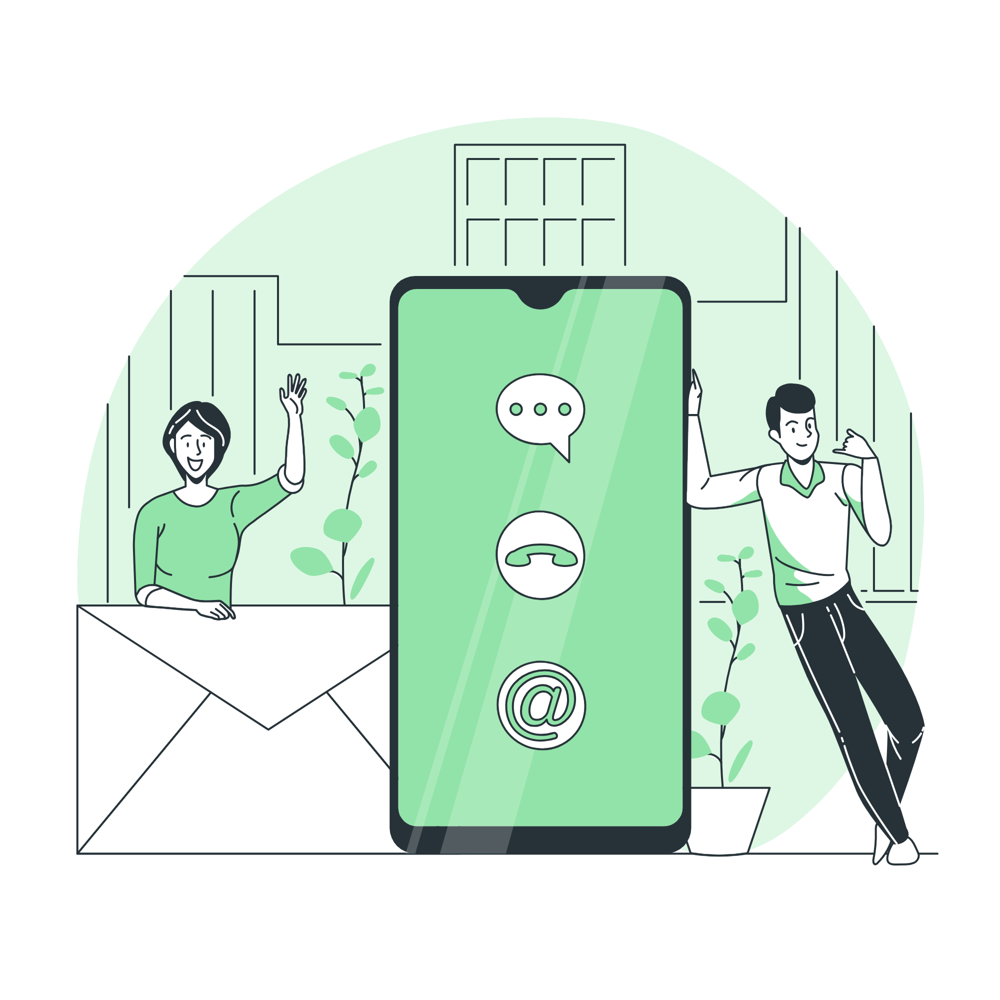

<h1>Under Construction!</h1>

My Contact Me Page is coming soon. Be sure to check back soon or contact me to get a sneak peak. 

    <a href = "https://xoluvs.github.io/aboutMe">About Me</a>
  

 

     <a href = "https://xoluvs.github.io/portfolioHome">Portfolio Home</a>
   

 

    <a href = "https://xoluvs.github.io/contactMe">Contact Me</a>
  

  

      
    

<h2>Contact Options</h2>

The best way to contact me is through one of my social media accounts or by email. Select from the following options. 

   

    

    

    

<h3 align="left"> Notes:</h3>

Some of the graphics and icons used to build this site can be found on <a href="https://storyset.com/work"> Storyset.com </a>.

