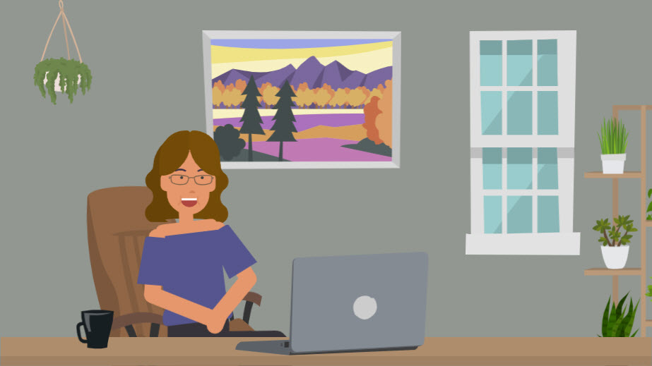
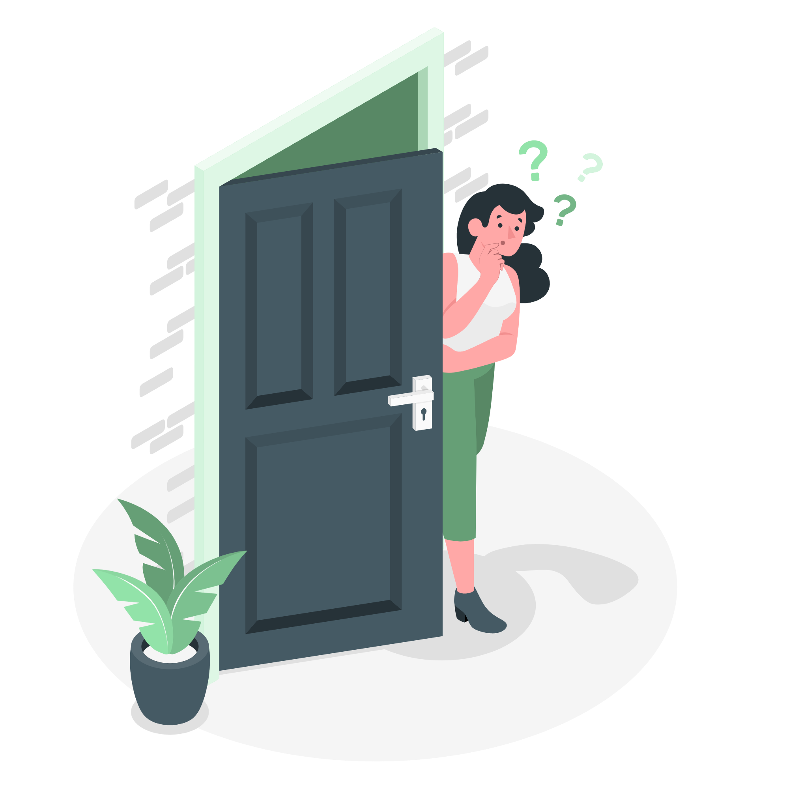

<h1 align="center"> Please pardon my mess. This site is in the early stage of construction!</h1>

 
 

<h1>Welcome!</h1>

As an Instructional Designer I have a passion in creating new and engaging solutions to training needs. From a quick 2–5-minute job aid, through a fully functional simulation, I find it exciting to measure the results of my work and see the impact I am making.

My skills include a variety of tools and coding that includes, Adobe Creative Suite, Articulate 360 and Storyline, Camtasia, Figma, JavaScripting, Learning Management System (LMS) administration, Vyond, and many others.  I thrive on teaching myself new skills and building new interactions that increase fun and learner engagement. 
 
My background includes experience working with emergency response agencies, customer service, technical training and troubleshooting, end user technology support, and many others. 

To learn more about who I am, visit the <b>About Me </b> section of my home. 

I appreciate the time you’re taking to look at my portfolio. 

  
   Enter this room to learn more about my work, volunteer activities, and passions.  

  
    Enter this room to learn more about my work, volunteer activities, and passions.  

  
  Enter this room to learn more about my work, volunteer activities, and passions.  

   
    Enter this room to learn more about my work, volunteer activities, and passions.  

<h3 align="left">🛠 Language and tools</h3>

Some of the graphics and icons used to build this site can be found on <a href="https://storyset.com/work"> Storyset.com </a>.

