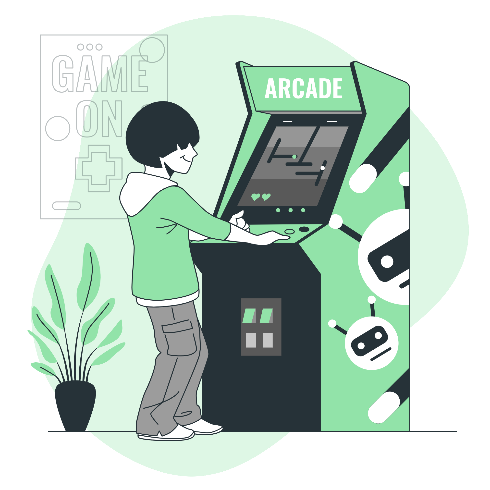

    <a href = "https://xoluvs.github.io/homePage">Home</a>
  

  

    <a href = "https://xoluvs.github.io/aboutMe">About Me</a>
  

 

     <a href = "https://xoluvs.github.io/portfolioHome">Portfolio Home</a>
   

 

    <a href = "https://xoluvs.github.io/contactMe">Contact Me</a>
  

      
    

<h2> Training Examples</h2>

  
  D9 Simulators are simplified replicas of a device or platform. These can be useful for technical training.   

 

<h4>Coming Soon </h4>

  
  Using a proper design model is critical throughout training design and developement. View some of my examples here.    

    
  View a few examples highlighting gamification elements that can be used with any training.    

 

<h4 align="left"> Notes:</h4>

Some of the graphics and icons used to build this site can be found on <a href="https://storyset.com/work"> Storyset.com </a>.
